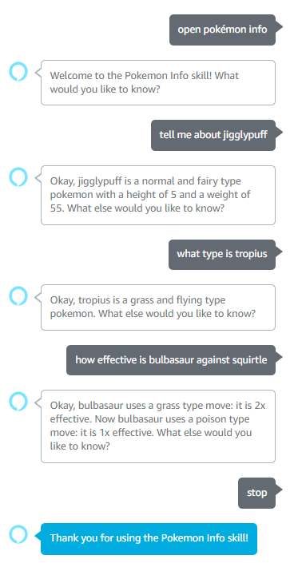

# pokemon-alexa-project

This is the Express server that handles the state of an Alexa Skill made for talking about Pokemon! It works by using the ASK SDK Express Adapter to work with Alexa and the PokeAPI for Pokemon info.

Here are the kinds of things you can ask it:
- Ask about a Pokemon: "Tell me about Jigglypuff."
- Ask about a trait of a Pokemon: "What type is Tropius?"
- See the type match-up between two Pokemon: "How effective is Bulbasaur against Squirtle?"

Here is a sample conversation using the Alexa Skill:

Bugs:
- I noticed that when I asked Alexa about Pikachu, it was processed as hearing "pikachū", thus it could not call the PokeAPI with the correct name. Could be fixed by manually replacing the ū with a u when "pikachū" is heard.
